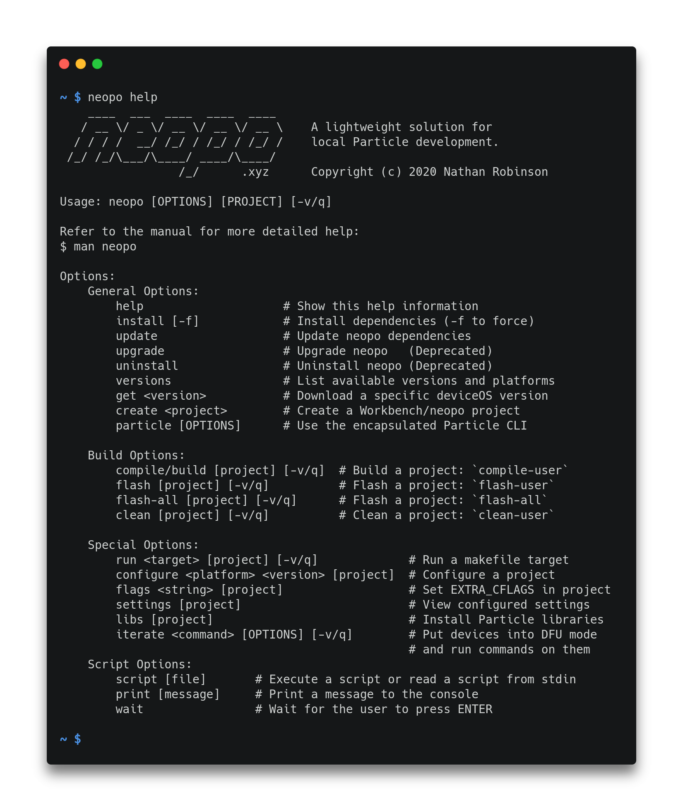

[](https://github.com/nrobinson2000/neopo/actions)
[](https://travis-ci.org/nrobinson2000/neopo)
[](https://hub.docker.com/r/nrobinson2000/neopo)
[](https://aur.archlinux.org/packages/neopo-git/)



## Features

- Builds Particle projects locally without any overhead.
- Compatible with Particle Workbench and Particle CLI.
- Installs and manages necessary Particle dependencies.
- Built with Python using only the standard library.
- Supports Linux, macOS, Windows, and Raspberry Pi.
- Supports tab completion to assist development.

## Installation

Universal Installer (Linux/macOS):

```bash
$ bash <(curl -sL neopo.xyz/install)
```

Install from [AUR](https://aur.archlinux.org/packages/neopo-git/):

```bash
$ yay -S neopo-git
$ neopo install
```

Install from source (pip):

```bash
$ git clone https://github.com/nrobinson2000/neopo
$ cd neopo
$ sudo python3 -m pip install .
$ neopo install
```

Docker container:

```bash
$ docker pull nrobinson2000/neopo
$ docker run -it nrobinson2000/neopo
```

For more installation information, please refer to the [Installation tutorial.](tutorials/install.html)

<script id="asciicast-392578" src="https://asciinema.org/a/392578.js" async></script>

## Usage

To get started with neopo, please refer to the [Quick Reference.](docs/quick-docs.html)

For descriptions of all available commands, please refer to the [Complete Reference.](docs/full-docs.html)